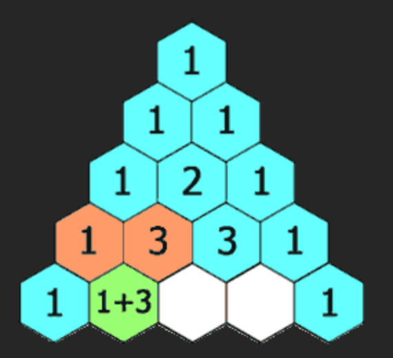
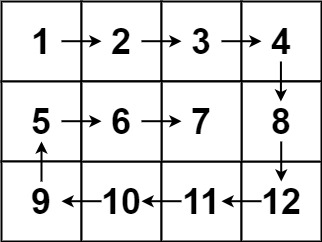

# Hands-on_Lecture_2

Implementation of Pascal's Triangle and Spiral Matrix from LeetCode

## LeetCode 118: Pascal's Triangle 

Leetcode Link: https://leetcode.com/problems/pascals-triangle/description/

### Problem
Given an integer `numRows`, return the first numRows of **Pascal's triangle**.  
In Pascal's triangle, each number is the sum of the two numbers directly above it as shown:



**Example 1**:
```
Input: numRows = 5
Output: [[1],[1,1],[1,2,1],[1,3,3,1],[1,4,6,4,1]]
```
**Example 2**:
```
Input: numRows = 1
Output: [[1]]
```

**Constraints**:
```
1 <= numRows <= 30
```

### Notes & Understanding the Problem
- Inputs: integer numRows
- Outputs: 2D List of integers
- outside of the triangle (or edges), the values are always `1`
- if `numRow` = 0, return empty list


**Working out example: `numRows` = 5**
```
Input: numRows = 5
Output: [[1],[1,1],[1,2,1],[1,3,3,1],[1,4,6,4,1]]

row 1: 1
row 2: 1, 1
row 3: 1, 1+1, 1 = 1, 2, 1
row 4: 1, 1+2, 2+1, 1 = 1, 3, 3, 1
row 5: 1, 1+3, 3+3, 3+1, 1 = 1, 4, 6, 4, 1
```
**Special Case: `numRows` = 0**
```
Input: numRows = 0
Output: []
```

This solution in [pascal_triangle.java](./pascal_triangle.java) would be using double loops, and will have a **time complexity** of **$O(n^2)$**. The downside to this is that it will be slower and computation heavy for larger inputs.

---

## LeetCode 54: Sprial Matrix

Leetcode Link: https://leetcode.com/problems/spiral-matrix/

### Problem
Given an `m x n` `matrix`, return *all elements of the* `matrix` *in spiral order*.

**Example 1**:


```
Input: matrix = [[1,2,3],[4,5,6],[7,8,9]]
Output: [1,2,3,6,9,8,7,4,5]
```

**Example 2**:


```
Input: matrix = [[1,2,3,4],[5,6,7,8],[9,10,11,12]]
Output: [1,2,3,4,8,12,11,10,9,5,6,7]
```
**Constraints**:
```
m == matrix.length
n == matrix[i].length
1 <= m, n <= 10
-100 <= matrix[i][j] <= 100
```
### Notes & Understanding the Problem
- Inputs: 2D matrix of integers
- Outputs: list
- need 4 pointers: left, right, top, bottom

This solution in [spiral_matrix.java](./spiral_matrix.java) will have a **time complexity** of **$O(m×n)$**, where `m` is the number of rows in the matrix, and `n` is the number of columns. The downside to this is that there are some overhead from the modulo and multiple conditionals. 